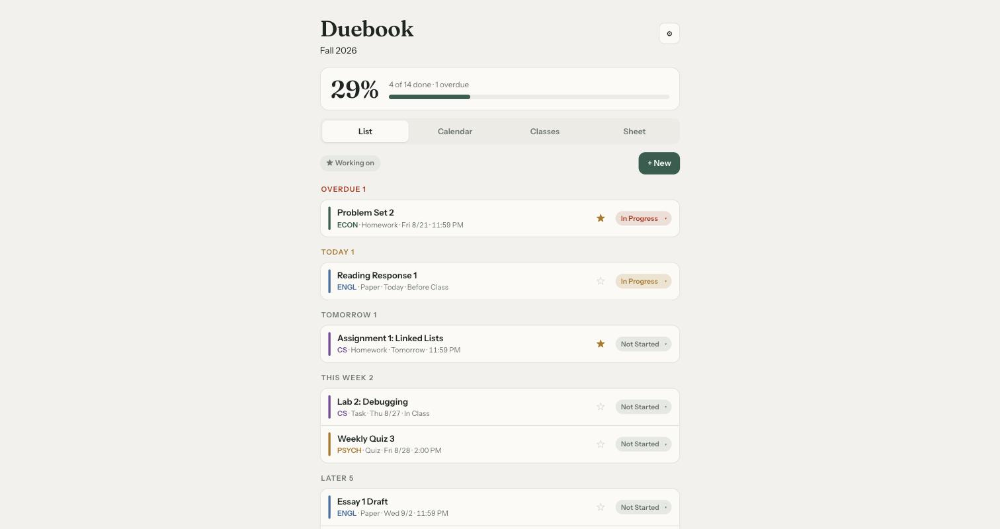
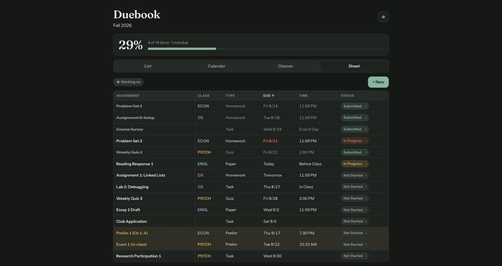
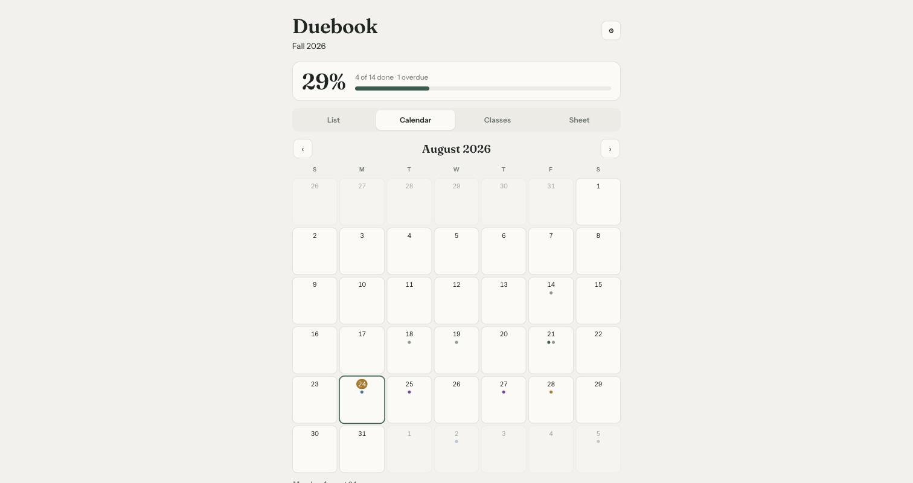
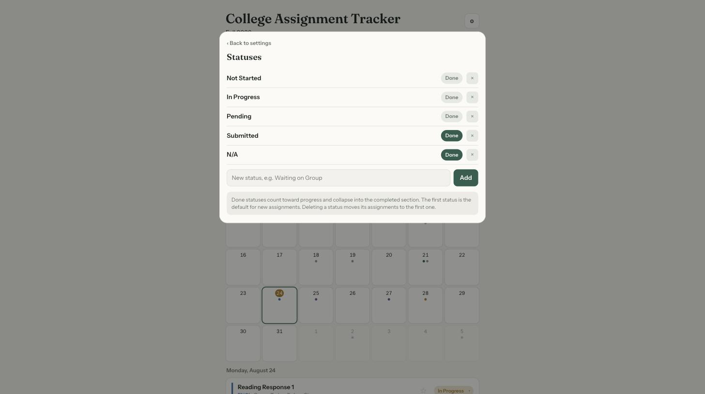

# College Assignment Tracker

A semester assignment tracker in a single HTML file. No account, no server, no build step, no dependencies. Open the file, add your classes, and every assignment for the semester lives in one place.

I built this to replace the Excel assignment tracker I had been dragging through every semester of college. The spreadsheet worked, but hiding rows by hand every time I finished something got old. This keeps the parts that worked (one master list, per-class progress, a month calendar) and automates the rest.

**[Try it live](https://gutowskid777.github.io/college-assignment-tracker/)** ... the demo is seeded with a sample semester. Your edits save in your own browser.



## What it does

- **List** groups everything by urgency: Overdue, Today, Tomorrow, This Week, Later. Finished work collapses out of view automatically instead of you hiding rows by hand.
- **Sheet** is a sortable table of the whole semester, closest to the original spreadsheet. Exams and other heavyweight types glow so they never sneak up on you.
- **Calendar** shows the month with a color dot per class.
- **Classes** tracks completion per class, like a syllabus progress bar.
- Status is a one-tap dropdown on every row. Star things you are actively working on and filter to just those.
- Multiple semesters, with old ones archived but never deleted.





## Make it yours

Statuses, assignment types, and due-time suggestions are all editable in Settings. Add a "Waiting on Group" status, a "Lab" type, mark which statuses count as done, and pick which types glow.



## Data

- Everything saves to your browser's localStorage. Nothing leaves your machine.
- Settings has one-click JSON export and import, so back up whenever you like and move between browsers freely.
- Light and dark theme both supported, following your system setting.

## Run it

Three options, pick one:

1. **Just open it.** Download `index.html` and double-click it. That is the whole install.
2. **Use the hosted demo.** [gutowskid777.github.io/college-assignment-tracker](https://gutowskid777.github.io/college-assignment-tracker/) works as a real tracker since data stays in your browser.
3. **Host it yourself.** It is one static file. Any static host or a `python3 -m http.server` works.
4. **Sync it across devices with Claude.** If you use Claude, the tracker can run as a private artifact that saves its data into the page itself, so your phone and laptop see the same list with no server and no account beyond Claude. Download `index.html`, open a session at claude.ai/code, and say:

   > Publish this HTML file as a private artifact with the artifact and downloads capabilities enabled.

   The app detects that runtime automatically: every edit publishes a new version of the page, and any device signed into your Claude account sees the same data. Without it, the app quietly falls back to browser storage, so the same file works everywhere.

## Development

`index.src.html` is the readable source with two placeholders. `build.py` injects a state JSON and a base64 copy of the source into `index.html`:

```
python3 build.py demo-state.json
```

The embedded source copy exists because the app can also run as a self-saving page on platforms that let a page publish new versions of itself, and rebuilding from a clean template beats serializing the live DOM.

The app is plain vanilla JS, one file, no framework. Fonts are Fraunces and Instrument Sans from Google Fonts, with system fallbacks when offline.

## License

MIT
